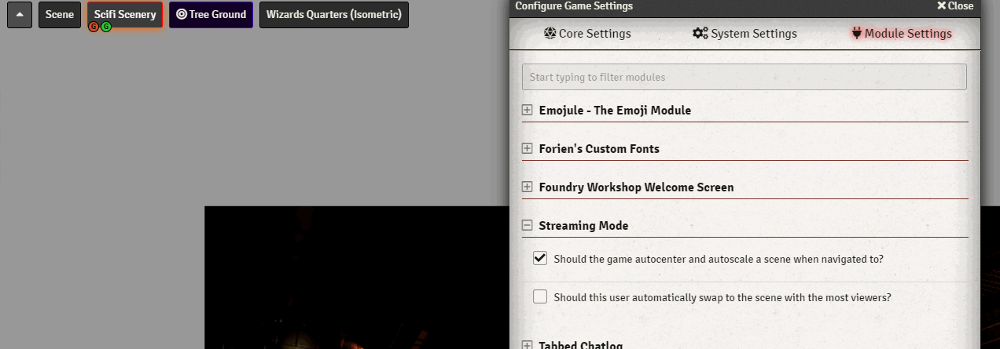

# FoundryVTT Streaming Mode

A set of quality of life features for a user configured as the viewport for a Stream

## Chrome not updating while in the background while recording / streaming?

See this solution: https://gitlab.com/foundrynet/foundryvtt/-/issues/4361#note_474818401

## Features

1) Autocenter and autoscale on scene change

2) Automatically swap the scene to the scene with the most users viewing it

## Changelog

### v1.1.0

Added auto-swap, reworked auto-center

### v1.1.1

Thanks to @SparkCities, we now have a Spanish translation!
Auto-swap is now far less aggressive about swapping
